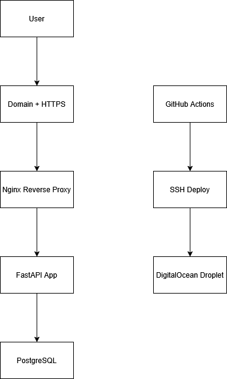
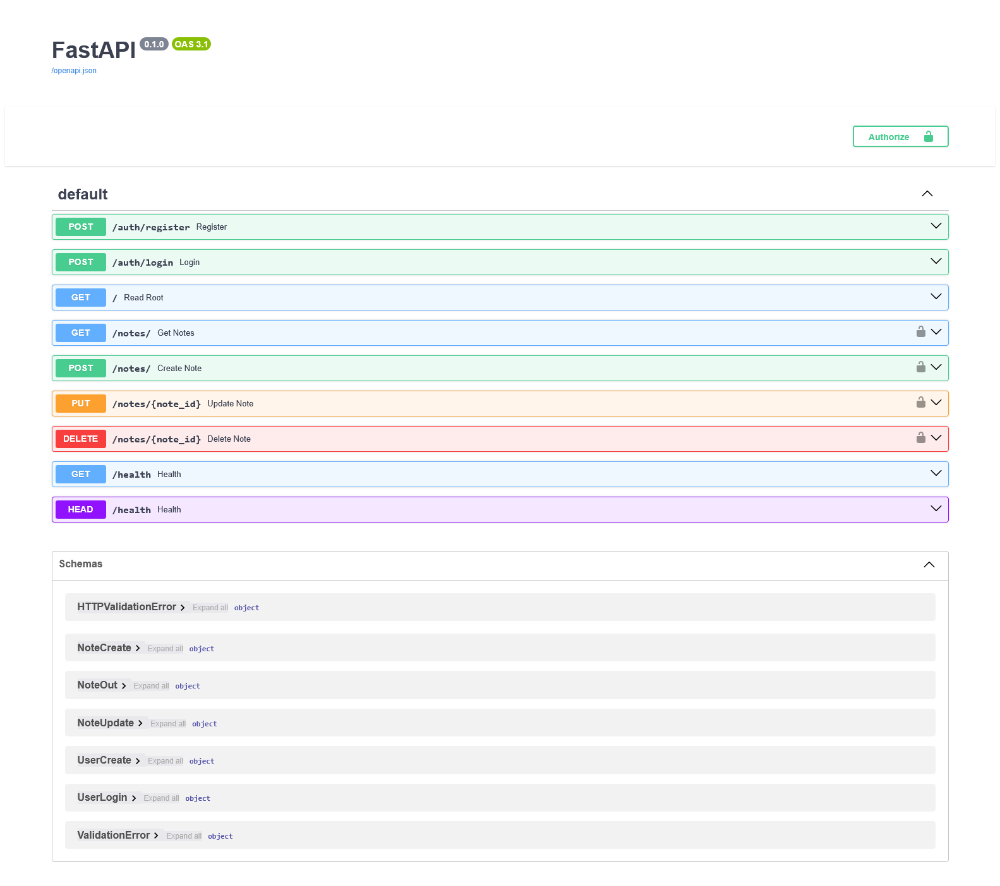
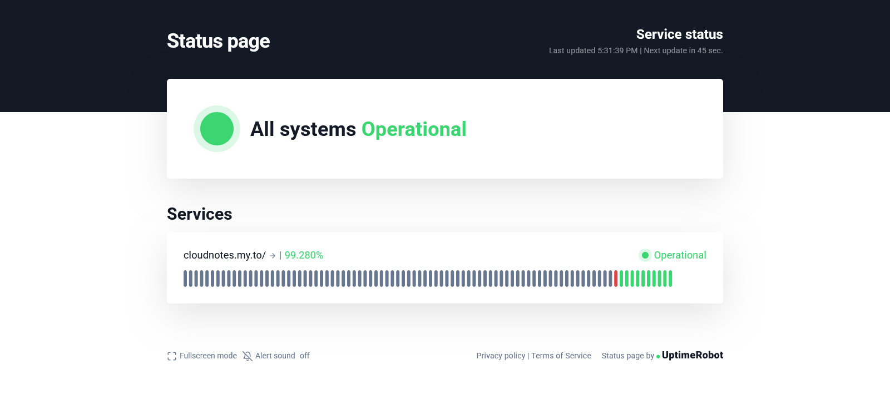
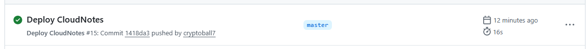
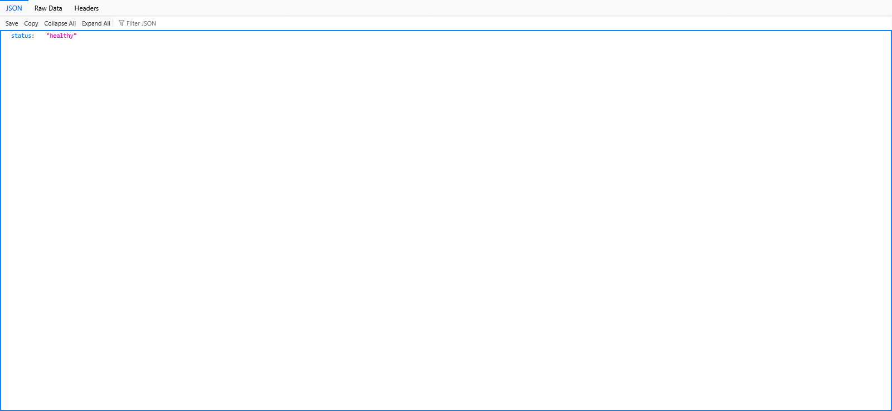
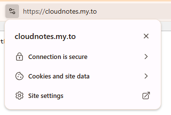

## Quick Start

```bash
git clone https://github.com/cryptoball7/cloudnotes.git
cd cloudnotes
cp .env-example .env
docker compose up --build
```

# CloudNotes

Production-ready multi-user notes SaaS built with FastAPI, PostgreSQL, Docker, Nginx, CI/CD, and HTTPS.

## Features

- JWT authentication
- User-specific notes CRUD
- Dockerized architecture
- PostgreSQL database
- Nginx reverse proxy
- HTTPS via Let's Encrypt
- GitHub Actions CI/CD
- Production logging
- Health monitoring

## Architecture



## Tech Stack

### Backend
- FastAPI
- PostgreSQL
- SQLAlchemy

### Infrastructure
- Docker
- Nginx
- DigitalOcean
- GitHub Actions
- Let's Encrypt

## Local Development

```bash
docker compose up --build
```

## Production Deployment

Automatic deployment via GitHub Actions.

git push → test → deploy → restart containers

## API Docs

https://cloudnotes.my.to/docs

## Monitoring

- Docker logs
- Nginx logs
- Uptime monitoring

## Screenshots







## Future Improvements

- Share notes via link
- Redis caching
- Background jobs
- Email verification

# Examples

## Register

```bash
curl -X POST \
"https://cloudnotes.my.to/auth/register?email=test@example.com&password=test123"
```

## Login

```bash
curl -X POST \
"https://cloudnotes.my.to/auth/login"
```

## Create Note

```bash
curl -X POST \
"https://cloudnotes.my.to/notes" \
-H "Authorization: Bearer TOKEN"
```

## Production Features

- HTTPS enforced
- Reverse proxy architecture
- Environment-based secrets
- CI/CD pipeline
- Auto deployment
- Dockerized services
- Persistent PostgreSQL storage
- Health checks
- Logging & monitoring

